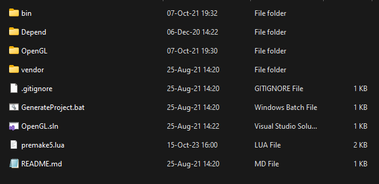

# Izvješće 1 - Postavljanje okoline za razvoj u OpenGL-u

Prvo je bilo potrebno podesiti razvojnu okolinu da bi se mogla razvijati grafička aplikacija za OpenGL. Korišteni alati su: 

- **C++** programski jezik
- **Visual Studio** - integrirano razvojno okruženje
- **Premake** - alat za generiranje projektnih datoteka za Visual Studio. Stvorio je konfiguracijske datoteke kako bi se projekt mogao lako postaviti za više platformi.
- **GLFW** - biblioteka za upravljanje prozorima i događajima. Ova biblioteka omogućila je kreiranje prozora i upravljanje ulazom.
- **GLAD** - biblioteka za upravljanje pokazivačima funkcija OpenGL-a. Omogućila nam je učitavanje potrebnih OpenGL funkcija
- **STB Image** - biblioteka za jednostavno učitavanje slika. Ova biblioteka omogućila je učitavanje tekstura koje se koriste u OpenGL aplikacijama
- **Assimp** - biblioteka  za učitavanje modela u različitim formatima. Ova biblioteka omogućila je aplikaciji da učita modele i koristi ih u sceni
- **git** - sustav za verzioniranje koda

## Struktura repozitorija



Na slici je prikazana struktura repozitorija:

- **bin** - *binary,* nalaze se **intermediate datoteke i izvršna datoteka aplikacije
- **Depend** -  *dependecies*, nalaze se GLFW i GLAD biblioteke, o kojima projekt ovisi
- **OpenGL** - projekt, sadržava sve kodove, modele, teksture i sl.
- **vendor** - nalazi sa izvršna datoteka premake5 aplikacije, koja generira Visual Studio solution
- **GenerateProject.bat** - batch skripta koja pokreće premake5 aplikcaiju
- .**gitignore** - opisane datoteke koje git ignorira
- **OpenGL.sln** - generirani Visual Studio solution
- **premake5.lua** - skripta za postavljanje Viusal Studio solutiona
- **README.md** - opis repozitorija

## Premake skripta

Skripta opisuje koji datoteke će se kompajlirati, povezivanje biblioteka, konfiguracije te spremanje izvršnih datoteka. Premkake skritpa: 

```lua
workspace "OpenGL"
    architecture "x64"

    configurations { "Debug",  "Release"}
    outputdir="%{cfg.buildcfg}-%{cfg.system}-%{cfg.architecture}"

project "OpenGL"
    location "OpenGL"
    kind "ConsoleApp"
    language "c++"

    targetdir("bin/" ..outputdir.."/%{prj.name}")
    objdir("bin/intermediates" ..outputdir.."/%{prj.name}")
    
    files
    {
        "%{prj.name}/src/**.h",
        "%{prj.name}/src/**.cpp",
        "%{prj.name}/src/**.c",
        "%{prj.name}/src/**.inl",
        "%{prj.name}/src/**.hpp",
        "%{prj.name}/src/vendor/stb_image/**.h",
        "%{prj.name}/src/vendor/stb_image/**.c",
        "%{prj.name}/src/vendor/glm/**.hpp",
        "%{prj.name}/src/vendor/glm/**.inl",
        "%{prj.name}/res/shaders/**.glsl"
    }

    includedirs
    {
        "%{prj.name}/src",
        "%{prj.name}/src/vendor",
        "Depend/Include"
	}

    libdirs
    {
         "Depend/Libraries",
	}

    links
    {
        "opengl32.lib",
        "glfw3.lib",
        "assimp-vc142-mtd.lib"
	}

    postbuildcommands
    {
       "{COPY} %{wks.location}Depend/Libraries/assimp-vc142-mtd.dll %{cfg.targetdir}"
    }

    filter "system:windows"
        cppdialect "c++17"
        systemversion "latest"

    filter "configurations:Debug"
        defines {"DEBUG"}
        symbols "on"

    filter "configurations:Release"
        defines {"NDEBUG"}
        optimize "on"
```

## Zaključak

Korištenjem Premake-a za konfiguriranje projektnih datoteka, Visual Studio-a kao razvojnog okruženja te spomenutih biblioteka, uspješno je postavljena okolina za razvoj aplikacija koje koriste OpenGL. Korištenje ovih alata i biblioteka olakšalo je proces razvoja, omogućavajući efikasno upravljanje prozorima, grafičkim funkcijama, matematičkim operacijama te učitavanje tekstura i modela.

Ovaj proces postavljanja okoline pruža čvrstu osnovu za daljnji razvoj grafičkih aplikacija koristeći OpenGL.