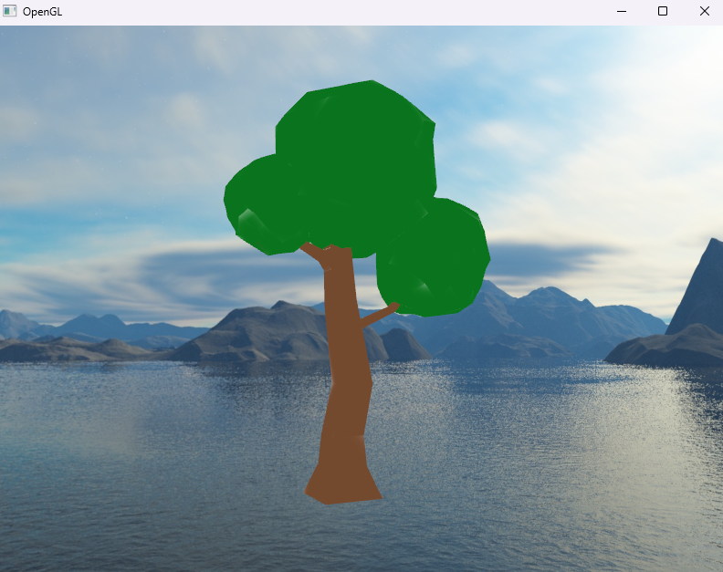
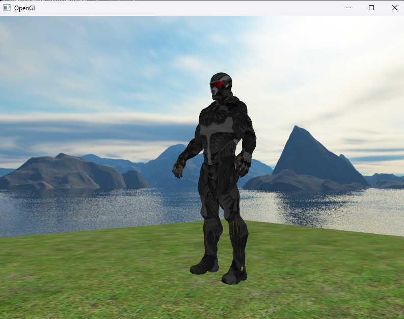

# Izvješće 4 - Assimp biblioteka

Assimp (Open Asset Import Library) je biblioteka otvorenog koda koja omogućava učitavanje i manipulaciju 3D modelima iz različitih formata datoteka. Ova biblioteka je korisna u računalnoj grafici za rad s modelima koje stvaraju različiti alati poput Blendera, Maya-e, 3ds Max-a i drugih.

Assimp omogućava:

- Format: OBJ, FBX, Collada, STL i drugi
- Učitavanje kompleksnih modela, odnosno informacije o geometriji, materijalima, teksturama i animacija
- Pristup podacima unutar modela, time omogućuju programerima da manipuliraju modelima
- Konverziju između formata

Assimp biblioteka ima svoju generalnu strukuturu podataka, stoga prvo se treba učitati u strukutru kakvu OpenGL prepoznaje. Za to je odgovorna Mesh klasa:

```cpp
#pragma once

#include "vector"

#include "Renderer.h"

struct Vertex
{
	glm::vec3 Position;
	glm::vec3 normal;
	glm::vec2 textureCordinates;
	glm::vec3 tangent;
	glm::vec3 bitangent;
};

struct Textures
{
	unsigned int id;
	std::string type;
	std::string path;
};

class Mesh
{
public:
	std::vector<Vertex> vertices;
	std::vector<unsigned int> indices;
	std::vector<Textures> textures;
	unsigned int VAO;

	Mesh(const std::vector<Vertex>& vertices,const std::vector<unsigned int>& indices,const std::vector<Textures>& textures);
	void Draw(const Shader& shader);
private:
	unsigned int VBO,IBO;
	void setupMesh();
};
```

Dok klasa Model predstavlja model kao cjelinu, sastoji se od više Mesheva i više tekstura:

```cpp
#pragma once

#include "Mesh.h"

#include "assimp/Importer.hpp"
#include "assimp/scene.h"
#include "assimp/postprocess.h"

#include <fstream>
#include <sstream>
#include <iostream>
#include <map>
#include <string>

unsigned int TextureFromFile(const char* path, const std::string& directory, bool gamma=false);

class Model
{
public:
	Model(std::string const& path,bool gamma=false);
	void Draw(const Shader& shader);
private:
	std::vector<Textures> textures_loaded;
	std::vector<Mesh> meshes;
	std::string directory;
	bool gammaCorrection;

	void LoadModel(std::string const& path);
	void ProcessNode(aiNode* node, const aiScene* scene);
	Mesh ProcessMesh(aiMesh* mesh, const aiScene* scene);
	std::vector<Textures> LoadMaterialTexture(aiMaterial* mat, aiTextureType type, std::string typeName);
};
```

Na slici je renderiran model stabla napravljen u Blenderu, zajedno s njegovim teksturama. Autor modela je Luka Pelivan. 



Na idućoj slici je renderiran nanosuit iz Crysis video igre.



## Zaključak

Assimp biblioteka pruža snažan alat za rad s 3D modelima, olakšavajući programerima učitavanje, manipulaciju i upotrebu modela u različitim formatima. Njezina podrška za širok spektar formata datoteka čini je vrijednim alatom u razvoju računalnih grafika i aplikacija. Integracija Assimp-a u aplikacije omogućava kreativnu slobodu i fleksibilnost u radu s 3D modelima.