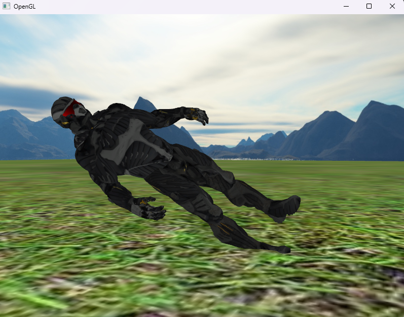

# Izvješće 5 - Transformacije

Transformacije su ključni dio u grafičkom programiranju koji omogućuje manipulaciju položaja, rotacije i skala objekata u 3D prostoru. Transformacije se primjenjuju pomoću matrica kako bi se postigla željena pozicija i orijentacija objekata. Matrice su temelj računalne grafike jer se njima postižu sve transformacije, kamere i projekcije. 

Osnovne transformacije su: 

- **skaliranje** - skalira vektor točke
- **rotiranje** - rotira točku oko određene osi
- **translacija** - translatira točku za neki vektor

Kamera (view matrica) je rezultat transformacija kordinata svijeta u kordinate ispred korisnikovog pogleda. Zapravo to je prostor iz  kamerine točke gledanja. Postiže se tako da korištenjem jednostavnih transformacija na određene objekte  ti objekti nađu ispred kamere. Tako se simulira kamera, i ovo nazivamo kamera radi boljeg opisa. Ako na primjer u video igri prvog lica naš lik stoji ispred zgrad i gleda u nju, te se on pomakne u desno. Mi kao korisnici dobivamo dojam da se naš lik pomaknuo u desno, zapravo on stoji na mjestu, a zagrada se translatirala u suprotnom smjeru odnosno u lijevo.  

U računalnoj grafici, projekcija se koristi za prikazivanje trodimenzionalnih objekata na dvodimenzionalnom zaslonu. Postoje dvije osnovne vrste projekcija u računalnoj grafici:

1. **Ortogonalna projekcija -** zadržava paralelne linije paralelnima bez obzira na udaljenost od gledatelja. Objekti zadržavaju istu veličinu bez obzira na njihovu udaljenost od kamere.
2. **Perspektivna projekcija** - simulira način na koji ljudsko oko percipira svijet. Ona stvara dojam dubine i perspektive tako što smanjuje veličinu objekata kako se udaljavaju od gledatelja te primjenjuje konvergenciju linija prema jednoj točki.

Ovisno o potrebama i vrsti scene, odabire se odgovarajuća vrsta projekcije kako bi se postigao željeni vizualni rezultat.

Množenjem dviju matrica dobivamo ulančanu matricu tih dviju. Tako da ulančavanjem ovih matrica možemo dobiti jednu matricu koja će odraditi sve operacije. Jako je važna matematička činjenica da množenje matrica nije komutativno, stoga redoslijed množenja je važan. Isto je važno da OpenGL koristi takozvani *row major order* konvenciju **što znači da su vektori osi zapisani u stupcima matrice, tj. točka je zapisana u 4x1 matrici te se nalazi s desne strane transformacije.

OpenGL je desni kordinatni sustav s vektorom prema naprijed izlazi iz ekrana. 

**GLM** (OpenGL Mathematics) je biblioteka matematičkih funkcija koja se koristi u OpenGL-u za obavljanje matematičkih operacija poput stvaranja i manipulacije matrica, vektora i transformacija. Ona pruža alate za upravljanje transformacijama i matematikom potrebnom za grafičke aplikacije.

U vertex shaderu objekta, ćemo deklarirati uniformu varijablu mvp tipa matrice 4x4, to je ulančana matrica svih gore navedenih transformacija. I u konačnici ćemo je pomnožiti s vektorom pozicije (točke) objekta. Dok ćemo ulančavanje mvp matrice računati na CPU.

```glsl
// ...

uniform mat4 mvp;

void main()
{
	// ...
	
	glPosition=mvp*vec4(objectPos, 1.0);	

	// ...
}
```

Korištenje transformacija na modelu nanosuita. Model ćemo smanjiti, rotirati za 90 stupnjeva oko y osi i z osi te ga translatirati po y osi. 

```cpp
//...

	while(/* Window is open */)
	{
		// ...

		glm::mat4 projection = glm::perspective(glm::radians(camera.GetZoom()),(float)SCR_WIDTH / (float)SCR_HEIGHT, 0.1f, 100.0f);
    glm::mat4 view = camera.View();
    glm::mat4 model = glm::mat4(1.0f);

    model = glm::translate(model, glm::vec3(0.0f, -7.5f, 0.0f));
    model = glm::rotate(model,glm::radians(90.0f),glm::vec3(0.0f,1.0f,1.0f));
    model = glm::scale(model, glm::vec3(0.25f));
    glm::mat4 mvp = projection*view*model;
            
    modelShader.Bind();
    modelShader.SetUniform4x4("mvp", mvp);
    nanosuit.Draw(modelShader);

		// ...
	}

//...
```

Redoslijed množenja matrica je projekcija, view, translacija, rotacija i na kraju skaliranje. Ali točka se u shaderu nalazi skroz s desne strane, stoga se zapravo prvo vrši skaliranje, odnosno obrnutim redoslijedom i na kraju projekcija.

Rezultat transformacija nad modelom je prikazan na slici. 



## Zaključak

Korištenje GLM biblioteke za manipulaciju transformacija, stvaranje kamere te primjenu ortogonalne i perspektivne projekcije pruža programerima snažan alat za razvoj kompleksnih 3D aplikacija. Ove funkcionalnosti omogućuju precizno upravljanje položajem i prikazom objekata unutar 3D prostora, doprinoseći realizmu i vizualnoj privlačnosti aplikacija koje se bave računalnom grafikom.