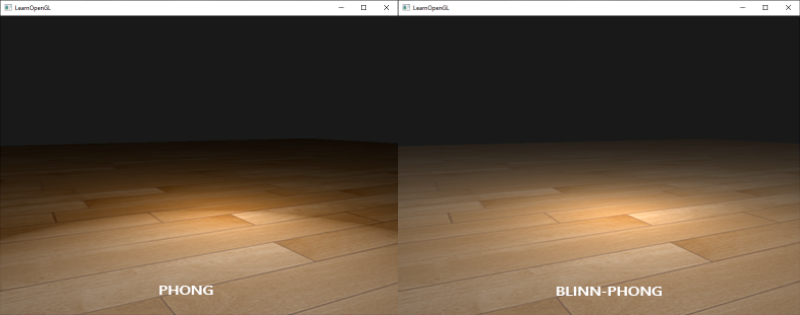

# Izvješće 7 - Osvjetljenje

Osvjetljenje u računalnoj grafici simulira način na koji svjetlo interagira s objektima u 3D prostoru, stvarajući realističan dojam. U grafici boje prikazujemo kombinacijom tri komponente: crvene (R), zelene (G) i plave (B). Simuliranje interakcije svjetla sa jednom bojom i objekta sa drugom bojom, postiže se jednostavnm množenjem svake od RGB komponenti.

## Phong model osvjetljenja

Najpoznatiji model osvjetljenja u računalnoj grafici zove se Phongov model i on prikazuje efekt
osvjetljenja kao linearnu kombinaciju (zbroj) tri elementa: ambientalni, difuzni i spekularni.

Na idućoj slici je prikazan Phongov model osvjetljenja: 


### Ambient komponenta

Ova komponenta predstavlja konstanu razinu svjetla, koja je prisutna u okolini bez obzira na izvor svjetlosti. Simulira slabi uniformni ton osvjetljenja, koje dopire do našeg objekta, time se postiže da naša scena nije u potpunom mraku. Ambient komponenta se računa: 

$$
v_{\text{finalColor}} = ambientStrength \cdot ambientColor \cdot objectColor
$$

### Diffuse komponenta

Ova komponenta simulira usmjereni utjecaj svjetlosnog objekta na drugi objekt. To je najvizualno značajna komponenta modela osvjetljenja. Što više dio objekta gleda prema izvoru svjetlosti, to postaje svjetliji. Objekti koji su okrenuti u suprotnom smjeru izvora, ostaju mračni. Za računanje ove komponente potrebna nam je pozicija izvora svjetlosti i normala površine objekta te se računa:

$$
v_{\text{lightDirection}} = \text{normalize}(v_{\text{lightPosition}} - v_{\text{fragmentPosition}})
$$

$$
v_{\text{finalColor}} = \text{dot}(v_{\text{normal}}, v_{\text{lightDirection}}) \times v_{\text{lightColor}} \times v_{\text{objectColor}}
$$

### Specular komponenta

Ova komponenta simulira odsjaj na nekom objektu. Za računanje ove komponente još nam je i potreban položaj promatrača odnosno njegov smjer gledanja. Računa se na sljedeći način:

$$
v_{\text{viewDirection}} = \text{normalize}(-v_{\text{viewPosition}} - v_{\text{fragmentPosition}})
$$

$$
v_{\text{reflectDirection}} = \text{reflect}(-v_{\text{lightDirection}}, v_{\text{normal}})
$$

$$
f_{\text{specular}} = \max\left(\text{dot}(v_{\text{viewDirection}}, v_{\text{reflectDirection}}), 0\right)^{n}
$$

$$
v_{\text{finalColor}} = f_{\text{specularStrength}} \times f_{\text{specular}} \times v_{\text{lightColor}} \times v_{\text{objectColor}}
$$

## Blinn-Phong model

Blinn-Phong model je modifikacija Phong modela koja koristi poluvektore kako bi aproksimirala reflektiranu svjetlost na površini. Ovaj model pruža realističniji izgled sjajnih površina. Ukoliko je kut između smjera gledanja i refleksije veći od 90 stupnjeva dolazi do poništavanja specular komponente. Blinn-Phong rješava ovi problem. Poluvektor H se dobiva preko smjera svjetlosti i smjera gledanja na idući način:

$$
\bar{H} = \frac{\bar{L} + \bar{V}}{||\bar{L} + \bar{V}||}
$$

Na slici je prikazana razlika između Phong i Blinn-Phong modela.



S ovim modelima možemo realizirati tipove svjetala poput:

- **Directional Light (Smjer svjetla)** - predstavlja beskonačno daleki izvor svjetlosti čiji su snopovi paralelni. Simulira svjetlo iz jednog smjera, primjer sunčeva svjetlost.
- **Spot Light (Usmjereno svjetlo)** - ovo svjetlo ima definiranu poziciju i smjer koji određuje konusni sno svjetlosti. Može se usmjeriti na određeno područje unutar scene.
- **Point Light (Točkasto svjetlo)** - simulira izvor svjetlosti koji dolazi iz određene točke i širi se ravnomjerno u svim smjerovima. Koristi se za simulaciju žarulje ili svjetiljke.

Implementacija funkcije za izračun spot lighta u fragment shaderu:

```glsl
//...

vec3 CalcSpotLight(SpotLight light,vec3 normal,vec3 viewDir,vec3 fragPos)
{
	vec3 lightDir=normalize(light.position-fragPos);

	vec3 ambient=light.ambient*texture(material.diffuse,TexCor).rgb;

	float diff=max(dot(lightDir,normal),0.0f);
	vec3 diffuse=light.diffuse*diff*texture(material.diffuse,TexCor).rgb;
	
	vec3 reflectDir=reflect(-lightDir,normal);
	float spec=pow(max(dot(viewDir,reflectDir),0.0f),material.shininess);
	vec3 specular=light.specular*spec*texture(material.specular,TexCor).rgb;

	float dist=distance(light.position,fragPos);
	float atten=1.0f/(light.constant+light.linear*dist+light.quadratic*dist*dist);
	
	diffuse*=atten;
	specular*=atten;

	float theta=dot(lightDir,normalize(-light.direction));
	float epsilon=light.cutOff-light.outOff;
	float intensity=clamp((theta-light.outOff)/epsilon,0,1);

	diffuse*=intensity;
	specular*=intensity;

	return (ambient+diffuse+specular);
}

//...
```

## Zaključak

Osvjetljenje u OpenGL-u je ključni element u stvaranju realističnih 3D scena. Phong model pruža osnovni koncept osvjetljenja s ambijentalnom, difuznom i spekularnom komponentom, dok Blinn-Phong model dodaje poboljšanje uz pomoć poluvektora za aproksimaciju reflektirane svjetlosti. Razumijevanje ovih modela omogućuje programerima da stvore vizualno bogate i uvjerljive 3D svjetove u OpenGL-u.