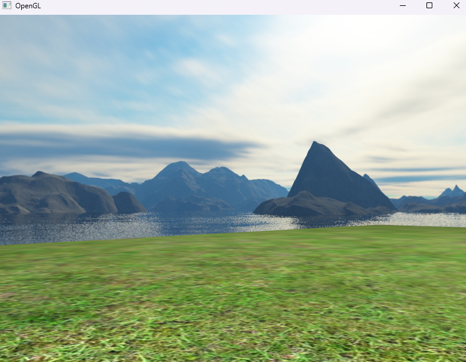

# Izvješće 8 - Cubemaps

CubeMap u OpenGL-u predstavlja teksturu koja omogućuje prikazivanje scene sa svih strana, stvarajući iluziju okoline ili prostora oko objekata. Ove teksture su oblikovane poput kocke, s 6 slika koje predstavljaju svaku stranu kocke: prednju, stražnju, gornju, donju, lijevu i desnu. Koriste se za stvaranje realističnog okoliša, refleksija ili pozadinskih elemenata u sceni. CubeMap se često koristi u kombinaciji s tehnologijom SkyBox.

SkyBox je tehnika koja koristi CubeMap teksture kako bi stvorila iluziju beskonačnog okoliša ili pozadine oko scene. Ove teksture pružaju efekt okoline koja okružuje sve objekte u sceni. SkyBox se koristi za stvaranje pozadinskih elemenata, poput horizonta, planina, neba ili gradskih silueta, pružajući korisniku dojam šireg prostora i dubine unutar 3D svijeta.

Na slici je prikazan uzorak skybox slike, jer kad bi je savili dobili bi teksturiranu kocku koja simulira pejzaž.


Funkcija u klasi teksture za generiranje skybox teksture:

```cpp
// ...

Texture::Texture(const std::vector<std::string>& faces)
{
	glGenTextures(1, &m_RenderID);
	glBindTexture(GL_TEXTURE_CUBE_MAP, m_RenderID);

	for (unsigned int i = 0; i < faces.size(); i++)
	{
		m_LocalBuffer = stbi_load(faces[i].c_str(), &m_Width, &m_Height, &m_BPP, 0);

		glTexImage2D(GL_TEXTURE_CUBE_MAP_POSITIVE_X + i, 0, GL_RGB, m_Width, m_Height, 0, GL_RGB, GL_UNSIGNED_BYTE, m_LocalBuffer);

		glTexParameteri(GL_TEXTURE_CUBE_MAP, GL_TEXTURE_MIN_FILTER, GL_LINEAR);
		glTexParameteri(GL_TEXTURE_CUBE_MAP, GL_TEXTURE_MAG_FILTER, GL_LINEAR);
		glTexParameteri(GL_TEXTURE_CUBE_MAP, GL_TEXTURE_WRAP_S, GL_CLAMP_TO_EDGE);
		glTexParameteri(GL_TEXTURE_CUBE_MAP, GL_TEXTURE_WRAP_T, GL_CLAMP_TO_EDGE);
		glTexParameteri(GL_TEXTURE_CUBE_MAP, GL_TEXTURE_WRAP_R, GL_CLAMP_TO_EDGE);

		if (m_LocalBuffer)
		{
			stbi_image_free(m_LocalBuffer);
		}
	}
}

// ...
```

Na slici je prikazan rezultat skybox.



## Zaključak

CubeMap i SkyBox su moćni alati u OpenGL-u koji omogućuju stvaranje uvjerljivih i vizualno bogatih okoliša u 3D aplikacijama. Kombinacija ovih tehnika pruža mogućnost detaljnijeg prikaza okoline unutar scene, poboljšavajući kvalitetu doživljaja korisnika.