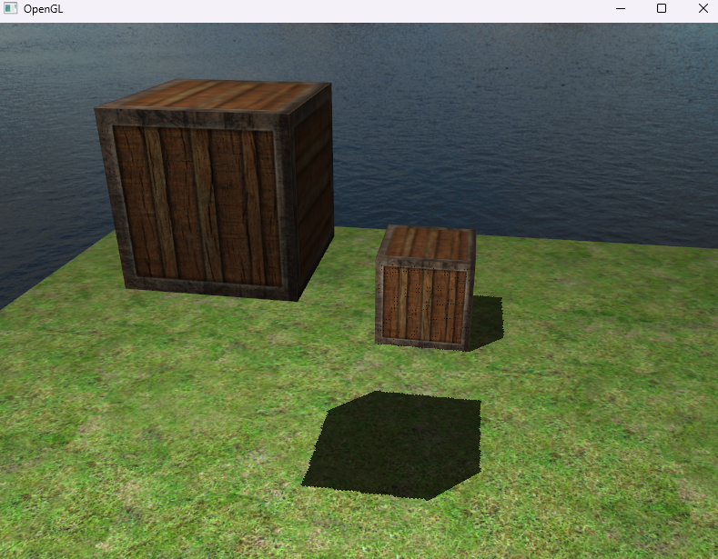

# Izvješće 9 - Sjene

Sjene su rezultat odsutnosti svjetla zbog okluzije. Kada zrake svjetlosti iz izvora svjetla ne pogode objekt jer je zaklonjen nekim drugim objektom, taj objekt je u sjeni. Sjene dodaju veliku dozu realizma osvijetljenoj sceni i olakšavaju promatraču da uoči prostorne odnose između objekata. Pružaju veći osjećaj dubine našoj sceni i objektima.

Sjene su malo komplicirane za implementaciju, posebno zato što u trenutnim istraživanjima u stvarnom vremenu (rasterizirana grafika) još nije razvijen savršen algoritam za sjene. Postoje nekoliko dobrih tehnika približavanja sjena, ali sve imaju svoje male čudnosti i smetnje koje moramo uzeti u obzir.

Jedna od tehnika za sjene je shadow mapping (mapiranje sjena), ova tehnika je relativno jednostavna za implementaciju te nije skupa za performance stoga se koristi u računalnim video igrama,

## Shadow mapping

Ova metoda mapira sjene, na način da našu scenu dva puta renderiramo. Prvo renderiramo iz točke gledanja izvora svjetlosti, sve što se vidi iz perspektive svjetlosti je osvjetljeno, a što se ne vidi je u sjeni. Rezultat prvog renderiranja je spremanje dubinskih vrijednosti u teksturu koju nazivamo depth map ili shadow map. Za spremanje u teksturu koristimo framebuffer. Nakon toga renderiramo drugi put, ali normalno scenu, odnosno iz točke gledanja (kamere) i renderiramo na zaslon, koristeći depth map teksturu. Time smo postigli jednostavnu realizaciju sjena.

Vertex shader za sjene:

```glsl
#version 330 core
layout(location=0) in vec3 aPos;
layout(location=1) in vec3 aNormal;
layout(location=2) in vec2 aTexCor;

out VS_OUT
{
	vec2 texCor;
	vec3 normal;
	vec3 fragPos;
	vec4 fragPosLightSpace;
}vs_out;

uniform mat4 projection;
uniform mat4 view;
uniform mat4 model;
uniform mat4 lightSpaceMatrix;

void main()
{
	vs_out.texCor=aTexCor;
	vs_out.normal=transpose(inverse(mat3(model)))*aNormal;
	vs_out.fragPos=vec3(model*vec4(aPos,1.0f));
	vs_out.fragPosLightSpace=lightSpaceMatrix*vec4(vs_out.fragPos,1.0);

	gl_Position=projection*view*model*vec4(aPos,1.0);
}
```

Fragment shader za sjene:

```glsl
#version 330 core
out vec4 fragColor;

in VS_OUT
{
	vec2 texCor;
	vec3 normal;
	vec3 fragPos;
	vec4 fragPosLightSpace;
}fs_in;

uniform sampler2D diffuseMap;
uniform sampler2D specularMap;
uniform sampler2D shadowMap;

uniform vec3 lightPos;
uniform vec3 viewPos;

float ShadowCalculation(vec4 fragPosLightSpace)
{
	vec3 projCor=fragPosLightSpace.xyz/fragPosLightSpace.w;

	projCor=0.5*projCor+0.5;

	float closestDepth=texture(shadowMap,projCor.xy).r;
	float currentDepth=projCor.z;
	
	float bias=0.005;
	float shadow=currentDepth-bias>closestDepth ? 1.0 : 0.0;

	if(projCor.z>1.0)
	{
		shadow=0.0;
	}

	return shadow;
}

void main()
{
	vec3 diffColor=texture(diffuseMap,fs_in.texCor).rgb;
	vec3 specColor=texture(specularMap,fs_in.texCor).rgb;
	vec3 normal=normalize(fs_in.normal);

	vec3 lightColor=vec3(1.0);
	vec3 lightDir=normalize(lightPos-fs_in.fragPos);
	vec3 viewDir=normalize(viewPos-fs_in.fragPos);

	vec3 ambient=0.3*diffColor;

	float diffuse=max(dot(normal,lightDir),0.0);
	vec3  diffuseLight=lightColor*diffuse*diffColor;

	vec3 halfwayDir=normalize(viewDir+lightDir);
	float spec=pow(max(dot(halfwayDir,normal),0.0),64.0);
	vec3 specularLight=lightColor*spec*specColor;

	float shadow=ShadowCalculation(fs_in.fragPosLightSpace);
	vec3 lighting=(ambient+(1.0-shadow)*(diffuseLight+specularLight)); 

	fragColor=vec4(lighting,1.0);
}
```

Renderiranje u petlji:

```cpp
// ...
int main()
{
	// ...
	while(/* Window is open */)
	{
		// ...
		
		depthShader.Bind();
    depthShader.SetUniform4x4("lightSpaceMatrix", lightSpaceMatrix);

    glViewport(0, 0, 1024, 1024);
    depthFBO.Bind();
    glClear(GL_DEPTH_BUFFER_BIT);
    diffuseMap.Bind();

    model = glm::mat4(1.0f);
    depthShader.SetUniform4x4("model", model);
    render.Draw(planeVa, depthShader, 6);

    for (unsigned int i = 0; i < 2; i++)
    {
	    model = glm::mat4(1.0f);
      model = glm::translate(model, cubePositions[i]);
      depthShader.SetUniform4x4("model", model);
      render.Draw(va, depthShader, 36);
    }

    depthFBO.UnBind();
                   
    glViewport(0, 0,SCR_WIDTH,SCR_HEIGHT);
    render.Clear();

    shadowShader.Bind();
    shadowShader.SetUniform4x4("projection", projection);
    shadowShader.SetUniform4x4("view", view);
    shadowShader.SetUniformVec3("lightPos", glm::vec3(-2.0f, 4.0f, -1.0f));
    shadowShader.SetUniformVec3("viewPos", camera.GetPosition());
    shadowShader.SetUniform4x4("lightSpaceMatrix", lightSpaceMatrix);

    diffuseMap.Bind(0);
    depthMap.Bind(1);

    model = glm::mat4(1.0f);
    shadowShader.SetUniform4x4("model", model);
    planeMap.Bind(0);
    planeMap.Bind(2);
    render.Draw(planeVa,shadowShader, 6);
              
    for (unsigned int i = 0; i < 2; i++)
    {
			model = glm::mat4(1.0f);
      model = glm::translate(model, cubePositions[i]);
      shadowShader.SetUniform4x4("model", model);
      diffuseMap.Bind(0);
      specularMap.Bind(2);
      render.Draw(va,shadowShader, 36);
    }		

		// ...
	}
	// ...
}
// ...
```

Rezultat sjena u sceni je prikazan na slici.



## Zaključak

Sjene su ključni aspekt realističnog prikaza u 3D scenama. Njihovo dodavanje pridonosi percepciji dubine, odnosa između objekata i svjetlosti te imerzivnosti scene. Uz tehnike poput stvaranja shadow mapa, soft shadows i drugih naprednih metoda, OpenGL omogućuje programerima da postignu visok stupanj realizma u prikazu sjena unutar svojih aplikacija. Integracija sjena u scene uvelike unaprjeđuje vizualno iskustvo korisnika.